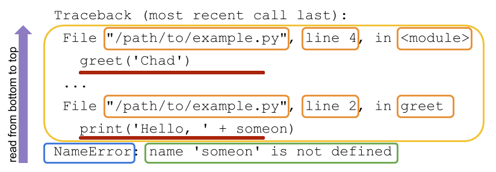

### Python Traceback in General

There is several sections to every python traceback, that are important. The
diagram below was a attempt to help you see those different parts.




In python its best to read the traceback from the bottom moving up. The last
line of the traceback I call the error message line and it contains the
exceptions name which was raised (outlined in blue). After, the exception name
is the error message (outlined in yellow). This message, usually contans
helpfull information for understanding the reason for the exception being
raised. Moving up the traceback (out-lined in green) is the different functon
calls moving from bottom to top, most recent to least recent. These calls are
repressented by two line entries for each call. The first line of each call
contains information like: the file name, line number and module name all
specifying where the code can be found. The second line for these calls
contains the actual code that was executed (underline in red).

There are a few difference between tracebacks output when executing your code
in the command-line and running code in the REPL, below is the same code from
the previous section executed in an `REPL` and the resulting traceback output.

\```pycon
>>> def greet( someone ):
>>>
...   print('Hello, ' +someon)
... 
>>> greet("Chad")

Traceback (most recent call last):
  File "", line 1, in 
  File "", line 2, in greet
NameError: name 'someon' is not defined
```
